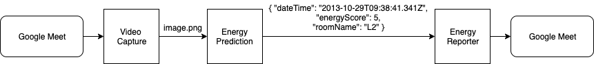

# Energize

ING Wholesale Banking Advanced Analytics Experimentation week project: Measure the energy in a meeting room!

## Setup
There are 3 parts to this project:

1. Capture the video feed, call Energy Prediction periodically
2. Based on images received, predict the energy in the room. Call Energy Reporter to report on it
3. Report energy data back to the video conference

